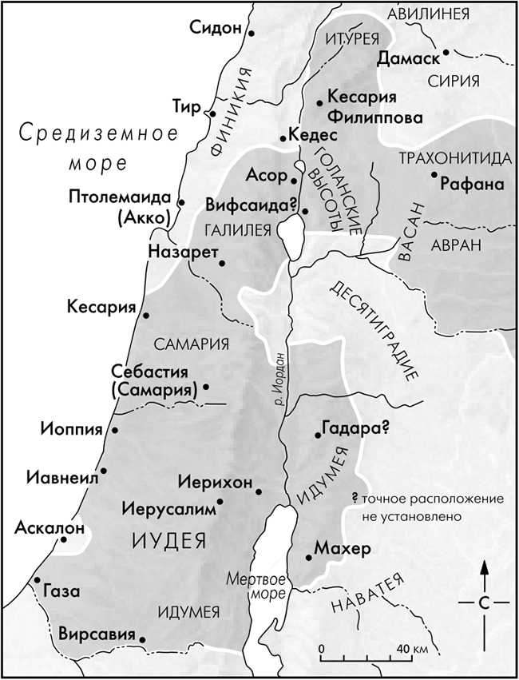

**1:1−4** Гэтыя вершы напісаны мовай, блізкай да класічнай грэчаскай. Лука звяртаецца да паважанага ім чалавека і тлумачыць, з якой мэтай ён прадпрымае гэты труд. Уводзіны да гэтага Евангелля адпавядаюць класічным канонам. ^b8902b

**ўжо многія ўзялíся склада́ць аповесць** — Вельмі многія раннехрысціянскія пісьмовыя творы да нас не дайшлі. ^ed7923

**як перадалí нам тыя** — Лука сам Іісуса не бачыў. ^adae62

**бывшие с самого начала очевидцами.** Т.е. все, о чем пишет Лука, основано на достоверных свидетельствах очевидцев.

**служы́целямі Слова.** — Маюцца на ўвазе тыя, хто з самага пачатку спавядаў Звону (Добрую Вестку). Для Лукі спавяданне слова (Дзеянні 8:4) раўназначна спавяданню казані Хрыста (Дзеянні 9:20).  ^4b433c

**дакладна дасле́даваўшы** — Сам Лука не быў сведкам апісваемых ім падзей. Ён піша, абапіраючыся на вынікі праведзеных ім даследаванняў; звесткі, атрыманыя ў ходзе гэтых даследаванняў, ён лічыць цалкам надзейнымі. ^ca3ce0

**высокашаноўны** — Гэтае слова ўжывалася ў звароце да людзей, якія займалі віднае становішча ў грамадстве (Дзеянні 23:26; Дзеянні 24:3). ^7fd314

**цвёрдую аснову** — Лука падкрэслівае, што чалавек, які прыняў вучэнне, павінен не толькі ведаць яго грунтоўна, але, больш за тое, ведаць пра заснавальніка. ^feec50

**наста́ўлены** — Гэтае слова часта ўжываецца ў сэнсе навучання асновам хрысціянскага веравучэння (вытворным ад грэчаскага «катэхео» — «настаўляю» — з'яўляецца слова «катэхізіс»). ^abf8d2

**у дні Ірада, цара Іудзейскага** — Маецца на ўвазе Ірад Вялікі, які кіраваў у 37−4 гг. да н.э. Апісваемыя евангелістам падзеі адносяцца да самага канца яго кіравання. Царства Ірада пры нараджэнні Ісуса ^c4256b

**з Авíевай чаргí** — У старозапаветныя часы іерусалімскі храм быў адзіным месцам, дзе магло адбывацца богаслужэнне. Таму ўсе свяшчэннікі былі падзелены на «чаргі», або змены, кожная з якіх служыла ў храме два разы на год па тыдні. Такіх чарг было дваццаць чатыры; Авіевая чарга — восьмая (1Пар 24:10). ^01cb93

**жонка яго з роду Ааро́навага, імя́ ёй Елісавета** — Для святароў лічылася вялікім шчасцем мець жонку таксама з святарскага роду. ^e0d49a

**1:6−7** Сказанае пра праведнасць Захары і Елізаветы не азначае, што яны былі зусім свабодныя ад граху: проста ад многіх суайчыннікаў іх адрознівала шчырая любоў да Бога і гарачае імкненне прытрымлівацца Яго запаветаў. Абладаючы такімі пахвальнымі якасцямі, яны павінны былі б удостоюцца Божага благаславення, і таму іх бяздзітнасць была асабліва сумнай — шматлікае нашчадства лічылася ў ізраільцян найвышэйшым з благаславенняў. ^a4f41a

**на схíле гадоў сваіх** — Святары няслі служэнне пажыццёва, працягваючы выконваць свае абавязкі і ў сталым узросце. ^fef60a

**вы́пала яму, паводле звы́чаю святарскага, кадзíць, увайшоўшы ў храм Гасподні** — Пры адзіным храме служыла вялікая колькасць святароў, і таму гонар здзейсніць кадзіцце ў святыні некаторым з іх выпадала толькі раз у жыцці, іншыя ж паміралі, так і не ўдостоюючыся яго. Захарыя ўвайшоў у Святое Святых разам з іншымі святарамі сваёй чаргі, але затым усе, акрамя яго, выйшлі адтуль, і ён у адзіноце кадзіў Богу. Гэты момант стаў вяршыняй яго жыццёвага шляху. ^7c34ad

**бо пачу́та малітва твая** — Захарыя мог маліцца аб дараванні яму сына або, што больш верагодна з улікам урачыстасці моманту, аб выратаванні Ізраіля. Нараджэнне Іаана можа разглядацца як адказ як на тую, так і на іншую малітву. ^6f0291

**Іаан** — У перакладзе з старажытнаяўрэйскага гэта імя азначае «Гасподзь міласэрны». ^ac0172

**не будзе піць віна́** — Гэтыя словы дазваляюць меркаваць, што Іаан Хрысціцель належаў да назарэяў. Лука ж пра яго назарэйства нічога не кажа і, у асобнасці, не ўказвае на абавязковы для назарэяў абет ніколі не абразаць валасы. Па ўсёй верагоднасці, Іаан займаў асаблівае месца сярод суайчыннікаў, не будучы ні святаром, ні назарэем. Ён — адзіны з дзеючых асобаў навазаветнай гісторыі, пра якога гаворыцца як пра напоўненага ад нараджэння Святога Духа. ^2f06ab

**у духу і сіле Іліí** — Гл. Мал 3:1; Мал 4:5. ^f7232a

**каб вярну́ць сэ́рцы бацькоў да дзяцей** — Сэнс гэтых слоў тлумачыцца наступным удакладненнем: вярнуць непакорлівым абраз думак праведнікаў. Такім чынам, пад «бацькамі» варта разумець патрыярхаў, а пад «дзяцьмі» — сучаснікаў Іаана (гл. 3:8). ^cfe95e

**каб падрыхтава́ць Госпаду народ гатовы** — Галоўным прызваннем Іаана Хрысціцеля было падрыхтаваць шлях Самому Госпаду (гл. 3:4). ^e028b3

**Гаўрыíл** — У перакладзе з старажытнаеўрэйскай гэта імя азначае «муж Божы». Гаўрыіл — адзін з двух анёлаў (другі — Міхаіл), названыя ў Пісанні па імяні. ^cb2788

**што стаю перад Богам** — Гэтым вызначэннем падкрэсліваецца веліч Гаврыіла (архангела), а таксама тое, што Захарыі варта безумоўна паверыць сказанаму ім. ^e1af16

**пасла́ны гаварыць з табой і дабраве́сціць табе гэта** — Ср. 1:28. Далей у Евангеллі ад Лукі слова «дабравесціць» выкарыстоўваецца ў значэнні «прапаведаваць Благую Вестку Хрыстову». ^d22404

**будзеш маўчаць** — Непавер'е Захарыі прывяло да таго, што, каб упэўніцца ў праўдзівасці слоў Гаврыіла, ён быў пазбаўлены дара мовы, які павінен быў вярнуцца да яго пры нараджэнні сына. ^19ed0c

**зразумелі, што ён бачыў відзе́нне** — Народ зразумеў гэта, убачыўшы, што Захарыя пазбавіўся дара мовы. ^58bed9

**зачала́ Елісавета** — Тым самым пацвердзілася праўдзівасць сказанага Захарыі анёлам. ^bb083d

**так зрабіў мне Гасподзь** — У сваёй доўгачаканай цяжарнасці Елізавета распазнала дзеянне Божага прамыслу. Ср. Быт 21:1−2, 6. ^fe8d1e

**каб зняць з мяне́ га́ньбу сярод людзе́й** — Бяздзетнасць лічылася ў старажытным Ізраілі карай з неба, і таму бяздзетныя жанчыны ўсімі спосабамі асуджаліся суайчыннікамі. Аднак цяпер Елізавета была цалкам апраўдана ў іх вачах (ср. Быт 30:23). ^af4a85

**А ў шосты месяц** — Т.е. калі Елізавета была на шостым месяцы цяжарнасці. ^3320f5

**зару́чанай з мужам** — Абручэнне ў Ізраілі было больш моцнай сувяззю, чым сучасная памолўка і, уласна, прадстаўляла сабой адну з формаў шлюбу. Пры абручэнні яшчэ не жылі разам, але для разрыву адносін патрабваўся фармальны развод. См. артыкул «[Нараджэнне Ісуса ад дзевы](https://bible.by/geneva-bible/0/55/)». ^e42187

**Благадатная** — Гэта слова варта разумець у тым сэнсе, што Марыя была напоўнена дасланай ёй зверху благадаццю, а не сама была крыніцай благадаці для іншых. ^f278f5

**Яна ж, убачыўшы яго, збянтэ́жылася ад слова яго** — У сваёй пакорлівасці Марыя недаўмела, чаму анёл назваў яе благадатнай. ^1052e8

**Іісус** — Грэцкае адпаведнасць імя Іешуа, якое азначае «Яхве — выратаванне» або «Яхве выратуе». ^267558

**Ён будзе вялікі** — Вялікасць Ісуса як Сына Усявышняга павінна была перасягнуць вялікасць, прадказаную Іаану (ст. 15). ^426b80

**прастол Давіда, бацькі Яго** — Яшчэ Давіду было прадказана, што Месіяй стане адзін з яго нашчадкаў (2Цар 7:12−16; Пс 88:30). ^7b44d5

**Царству Яго не будзе канца** — Вечным царствам можа быць толькі Царства Божае. ^62b766

**як будзе гэта** — Задаючы гэтае пытанне, Марыя відавочна ўсведамляе, што Сына яна зачае нейкім цудоўным чынам. ^d1ffc0

**Елісавета, сваячка Твая** — Гэтыя словы прымушаюць некаторых меркаваць, што Ісуса нельга называць «сыном Давідавым», паколькі, як яны разважаюць, нашчадак Давіда Іосіф да Яго нараджэння адносін не меў, а маці, Марыя, была сваячкай Елізаветы і, адпаведна, як і яна, вяла свой род ад Аарона ([[../Частка-1#^2e9626|ст. 5]]), а не ад Давіда. Аднак відавочна, што адзін з бацькоў Марыі быў з ліку нашчадкаў Аарона, а другі — Давіда. ^d932b6

**пайшла з паспе́шнасцю ў горны край, у горад Іу́даў** — Марыя, відавочна, адправілася да Елізаветы неадкладна пасля з'яўлення ёй анёла: Елізавета ў гэты час была на шостым месяцы цяжарнасці ([[../Частка-1#^2d9aaf|ст. 36]]); правёўшы з сваячкай тры месяцы ([[../Частка-1#^30034d|ст. 56]]), яна пакінула яе перад самым нараджэннем Іаана ([[../Частка-1#^aa28a9|ст. 57]]). ^c03822

**напоўнілася Елісавета Духам Святым** — Менавіта натхненне Святога Духа дазволіла Елізавеце распазнаць у руху немаўляці ў чреве выяўленне радасці ад набліжэння «Маці Госпада» ([[../Частка-1#^8715ac|ст. 43]]). Абранне Господам Марыі Елізавета тлумачыць яе глыбокай і шчырай верай ([[../Частка-1#^5df456|ст. 45]]). ^7f09e6

**блажэнная Тая, што паверыла** — Даслоўны пераклад гэтай фразы: «І Блажэнна паверыўшая таму, што будзе здзейсненае сказанае ёй ад Госпада». «Блажэнства» Марыі цесна звязана са словам «паверыўшая». Ср. Евр 11:1: «Вера ж ёсць ажыццяўленне чаканага і ўпэўненасць у нябачным». ^596c3d

**1:46−55** — Хвалебная песня Марыі пераклікаецца з псалмамі Давіда, у якіх ён, як і Марыя — яго аддалены нашчадак, славіць Госпада (гл., напрыклад, Пс 33:1−9; Пс 34:9−10; 99; 102; 103; 112; 116; 127; 135; 137; 144; 149; 150). ^dc0dea

**Спасіцелі Маім** — Cпасіцеля Марыя бачыць у Боге. ^2a57e2

**спагля́нуў Ён на пако́ру Рабы Сваёй** — Пакорлівасць — адна з найважнейшых рыс, якія вызначаюць аблічча Марыі. ^461659

**будуць зваць Мяне блажэ́ннай усе ро́ды** — Букв.: «праслаўляць», «называць шчаслівай». ^1987a4

**1:51−53 праявíў сілу... рассе́яў... скінуў... ўзнёс... здаво́ліў дабром** — У многіх сучасных перакладах гэтыя дзеясловы ставяцца ў цяперашнім часе, тады як у грэчаскім тэксце Лукі ўсе яны — у аарысце. Спецыфіка гэтай часавой формы такая, што з яе дапамогай можна гаварыць як пра падзеі мінулага, так і пра тое, што яшчэ толькі павінна здзейсніцца. Словы Марыі, відавочна, з'яўляюцца менавіта прароцтвам пра будучыя дзеянні Госпада. ^f43ee7

**гаварыў бацька́м нашым, — да Аўраама** — У тым, што адбылося з ёй, Марыя бачыць здзяйсненне абяцанняў Бога, дадзеных патрыярхам. ^f09567

**у восьмы дзень прыйшлі абрэ́заць дзіця́** — Закон прадпісваў здзяйсняць над хлопчыкамі абразанне на восьмы дзень пасля нараджэння (Быт 17:12). ^9f816a

**стаў гаварыць, благаслаўля́ючы Бога** — Захарыя прытрымліваўся перададзенага праз анёла загадаў назваць сына Іаанам, і за паслухмянасць яму быў вярнуты дар мовы. Першы яго словамі стала хвала Госпаду. ^d1b9de

**быў страх ва ўсіх** — Знамя Боскай прысутнасці не можа не напоўніць сэрцы веруючых страхам Божым. ^d98f8e

**ўзняў нам рог спасення** — "Рог" у Пісанні, як правіла, сімвалізуе сілу і магутнасць. Гэтыя словы такім чынам азначаюць: «дараваў нам вялікага Збавіцеля». ^73e260

**ў доме Давіда, слугí Свайго** — Гэтыя словы паказваюць на тое, што гаворка ідзе не аб Іаане, а аб Том, Каму ён быў закліканы падрыхтаваць шлях. ^afc20c

**кля́тву, якой кля́ўся Ён Аўрааму** — У ВЗ распавядаецца аб заключэнні і аднаўленні Госпадам некалькіх запаветаў са Сваім народам. Асноватворным заўсёды лічыўся Яго запавет з Аўраамам (Быт, гл. 17). ^96af2c

**ты, дзіця́, прарокам Усявышняга будзеш назва́на** — Да гэтага часу Захарыя гаварыў пра Месію; цяпер ён звяртаецца да свайго сына, прызванага стаць папярэднікам Госпада. ^14eafd

**было́ ў пусты́нях** — Юнацтва Іаан правёў у пустынных мясцінах, дзе, магчыма, меў кантакт з прадстаўнікамі рэлігійных супольнасцяў, падобных Кумранскай.. ^608c8e